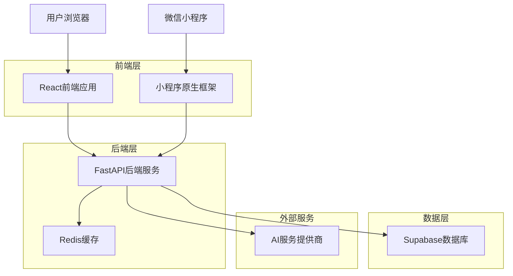
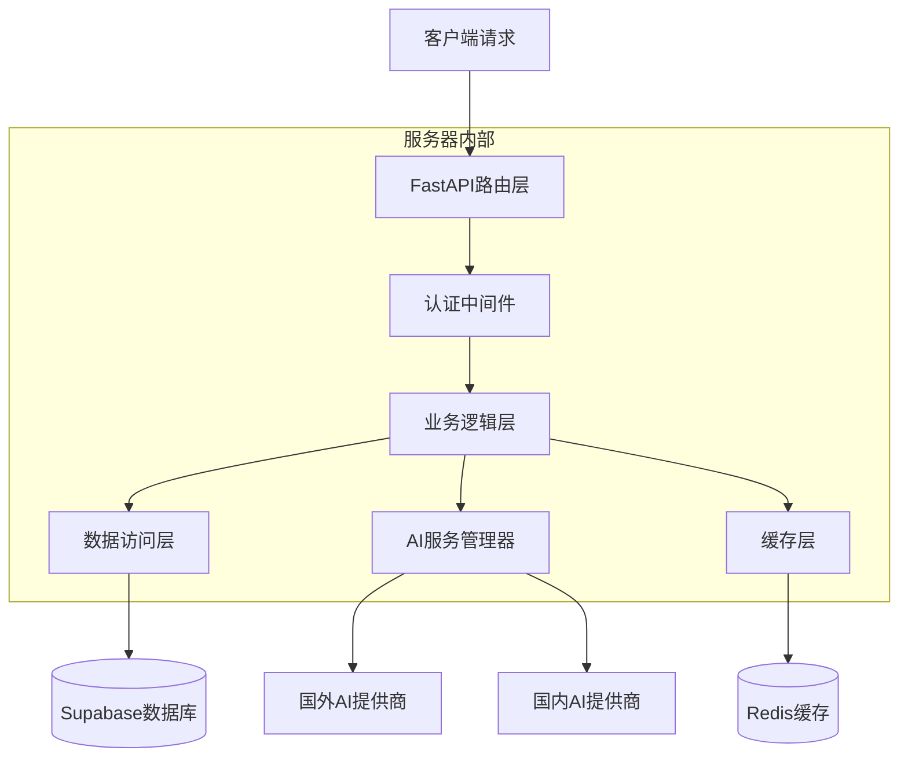
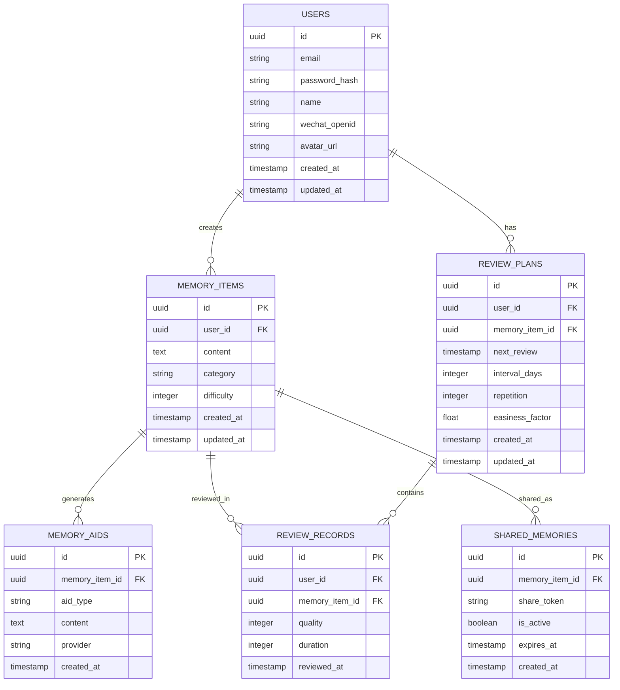

# MemBuddy 技术架构文档

## 1. 架构设计



## 2. 技术描述

* **前端**: React\@18 + Next.js\@14 + TailwindCSS\@3 + Framer Motion

* **小程序**: 微信小程序原生框架

* **后端**: FastAPI\@0.104 + Python\@3.11

* **数据库**: Supabase (PostgreSQL)

* **缓存**: Redis (计划中)

* **AI服务**: 多提供商支持 (OpenAI, Google AI, 国内AI服务商)

* **认证**: Supabase Auth + JWT

* **部署**: Docker + 阿里云

## 3. 路由定义

### 3.1 前端路由

| 路由              | 用途             |
| --------------- | -------------- |
| /               | 主页，记忆内容输入和管理   |
| /login          | 用户登录页面         |
| /register       | 用户注册页面         |
| /memory-library | 记忆库，查看和管理所有记忆项 |
| /review         | 复习页面，智能复习计划    |
| /profile        | 用户个人资料和设置      |

### 3.2 小程序路由

| 路由                         | 用途           |
| -------------------------- | ------------ |
| pages/index/index          | 小程序主页，核心功能入口 |
| pages/login/login          | 微信登录页面       |
| pages/memory-library/index | 记忆库页面        |
| pages/memory-detail/index  | 记忆详情页面       |
| pages/review/index         | 复习页面         |
| pages/profile/index        | 个人中心页面       |

## 4. API定义

### 4.1 认证相关API

#### 用户注册

```
POST /api/auth/register
```

请求参数:

| 参数名      | 参数类型   | 是否必需 | 描述   |
| -------- | ------ | ---- | ---- |
| email    | string | true | 用户邮箱 |
| password | string | true | 用户密码 |
| name     | string | true | 用户姓名 |

响应:

| 参数名     | 参数类型    | 描述     |
| ------- | ------- | ------ |
| success | boolean | 注册是否成功 |
| message | string  | 响应消息   |
| user    | object  | 用户信息   |

#### 用户登录

```
POST /api/auth/login
```

请求参数:

| 参数名      | 参数类型   | 是否必需 | 描述   |
| -------- | ------ | ---- | ---- |
| email    | string | true | 用户邮箱 |
| password | string | true | 用户密码 |

响应:

| 参数名           | 参数类型   | 描述      |
| ------------- | ------ | ------- |
| access\_token | string | JWT访问令牌 |
| user          | object | 用户信息    |

#### 微信小程序登录

```
POST /api/auth/wechat-login
```

请求参数:

| 参数名         | 参数类型   | 是否必需  | 描述      |
| ----------- | ------ | ----- | ------- |
| code        | string | true  | 微信授权码   |
| nickname    | string | false | 用户昵称    |
| avatar\_url | string | false | 用户头像URL |

### 4.2 记忆管理API

#### 创建记忆项

```
POST /api/memory-items
```

请求参数:

| 参数名        | 参数类型    | 是否必需  | 描述        |
| ---------- | ------- | ----- | --------- |
| content    | string  | true  | 记忆内容      |
| category   | string  | false | 分类标签      |
| difficulty | integer | false | 难度等级(1-5) |

#### 获取记忆项列表

```
GET /api/memory-items
```

查询参数:

| 参数名      | 参数类型    | 是否必需  | 描述        |
| -------- | ------- | ----- | --------- |
| page     | integer | false | 页码，默认1    |
| limit    | integer | false | 每页数量，默认20 |
| category | string  | false | 分类筛选      |
| search   | string  | false | 搜索关键词     |

### 4.3 AI生成API

#### 生成记忆辅助

```
POST /api/ai/generate-memory-aid
```

请求参数:

| 参数名              | 参数类型   | 是否必需  | 描述                             |
| ---------------- | ------ | ----- | ------------------------------ |
| memory\_item\_id | string | true  | 记忆项ID                          |
| aid\_type        | string | true  | 辅助类型(mindmap/mnemonic/sensory) |
| custom\_prompt   | string | false | 自定义提示词                         |

响应:

| 参数名       | 参数类型   | 描述      |
| --------- | ------ | ------- |
| aid\_id   | string | 生成的辅助ID |
| content   | string | 生成的辅助内容 |
| aid\_type | string | 辅助类型    |

### 4.4 复习系统API

#### 获取复习计划

```
GET /api/review/plan
```

响应:

| 参数名             | 参数类型  | 描述     |
| --------------- | ----- | ------ |
| today\_items    | array | 今日复习项目 |
| upcoming\_items | array | 即将复习项目 |
| overdue\_items  | array | 逾期复习项目 |

#### 提交复习结果

```
POST /api/review/submit
```

请求参数:

| 参数名              | 参数类型    | 是否必需  | 描述        |
| ---------------- | ------- | ----- | --------- |
| memory\_item\_id | string  | true  | 记忆项ID     |
| quality          | integer | true  | 复习质量(1-5) |
| duration         | integer | false | 复习时长(秒)   |

## 5. 服务器架构图



## 6. 数据模型

### 6.1 数据模型定义



### 6.2 数据定义语言

#### 用户表 (users)

```sql
-- 创建用户表
CREATE TABLE users (
    id UUID PRIMARY KEY DEFAULT gen_random_uuid(),
    email VARCHAR(255) UNIQUE,
    password_hash VARCHAR(255),
    name VARCHAR(100) NOT NULL,
    wechat_openid VARCHAR(100) UNIQUE,
    avatar_url TEXT,
    created_at TIMESTAMP WITH TIME ZONE DEFAULT NOW(),
    updated_at TIMESTAMP WITH TIME ZONE DEFAULT NOW()
);

-- 创建索引
CREATE INDEX idx_users_email ON users(email);
CREATE INDEX idx_users_wechat_openid ON users(wechat_openid);

-- 设置权限
GRANT SELECT ON users TO anon;
GRANT ALL PRIVILEGES ON users TO authenticated;
```

#### 记忆项表 (memory\_items)

```sql
-- 创建记忆项表
CREATE TABLE memory_items (
    id UUID PRIMARY KEY DEFAULT gen_random_uuid(),
    user_id UUID NOT NULL REFERENCES users(id) ON DELETE CASCADE,
    content TEXT NOT NULL,
    category VARCHAR(50),
    difficulty INTEGER CHECK (difficulty >= 1 AND difficulty <= 5),
    created_at TIMESTAMP WITH TIME ZONE DEFAULT NOW(),
    updated_at TIMESTAMP WITH TIME ZONE DEFAULT NOW()
);

-- 创建索引
CREATE INDEX idx_memory_items_user_id ON memory_items(user_id);
CREATE INDEX idx_memory_items_category ON memory_items(category);
CREATE INDEX idx_memory_items_created_at ON memory_items(created_at DESC);

-- 设置权限
GRANT SELECT ON memory_items TO anon;
GRANT ALL PRIVILEGES ON memory_items TO authenticated;
```

#### 记忆辅助表 (memory\_aids)

```sql
-- 创建记忆辅助表
CREATE TABLE memory_aids (
    id UUID PRIMARY KEY DEFAULT gen_random_uuid(),
    memory_item_id UUID NOT NULL REFERENCES memory_items(id) ON DELETE CASCADE,
    aid_type VARCHAR(20) NOT NULL CHECK (aid_type IN ('mindmap', 'mnemonic', 'sensory')),
    content TEXT NOT NULL,
    provider VARCHAR(50),
    created_at TIMESTAMP WITH TIME ZONE DEFAULT NOW()
);

-- 创建索引
CREATE INDEX idx_memory_aids_memory_item_id ON memory_aids(memory_item_id);
CREATE INDEX idx_memory_aids_aid_type ON memory_aids(aid_type);

-- 设置权限
GRANT SELECT ON memory_aids TO anon;
GRANT ALL PRIVILEGES ON memory_aids TO authenticated;
```

#### 复习计划表 (review\_plans)

```sql
-- 创建复习计划表
CREATE TABLE review_plans (
    id UUID PRIMARY KEY DEFAULT gen_random_uuid(),
    user_id UUID NOT NULL REFERENCES users(id) ON DELETE CASCADE,
    memory_item_id UUID NOT NULL REFERENCES memory_items(id) ON DELETE CASCADE,
    next_review TIMESTAMP WITH TIME ZONE NOT NULL,
    interval_days INTEGER DEFAULT 1,
    repetition INTEGER DEFAULT 0,
    easiness_factor FLOAT DEFAULT 2.5,
    created_at TIMESTAMP WITH TIME ZONE DEFAULT NOW(),
    updated_at TIMESTAMP WITH TIME ZONE DEFAULT NOW(),
    UNIQUE(user_id, memory_item_id)
);

-- 创建索引
CREATE INDEX idx_review_plans_user_id ON review_plans(user_id);
CREATE INDEX idx_review_plans_next_review ON review_plans(next_review);
CREATE INDEX idx_review_plans_memory_item_id ON review_plans(memory_item_id);

-- 设置权限
GRANT SELECT ON review_plans TO anon;
GRANT ALL PRIVILEGES ON review_plans TO authenticated;
```

#### 复习记录表 (review\_records)

```sql
-- 创建复习记录表
CREATE TABLE review_records (
    id UUID PRIMARY KEY DEFAULT gen_random_uuid(),
    user_id UUID NOT NULL REFERENCES users(id) ON DELETE CASCADE,
    memory_item_id UUID NOT NULL REFERENCES memory_items(id) ON DELETE CASCADE,
    quality INTEGER NOT NULL CHECK (quality >= 1 AND quality <= 5),
    duration INTEGER, -- 复习时长(秒)
    reviewed_at TIMESTAMP WITH TIME ZONE DEFAULT NOW()
);

-- 创建索引
CREATE INDEX idx_review_records_user_id ON review_records(user_id);
CREATE INDEX idx_review_records_memory_item_id ON review_records(memory_item_id);
CREATE INDEX idx_review_records_reviewed_at ON review_records(reviewed_at DESC);

-- 设置权限
GRANT SELECT ON review_records TO anon;
GRANT ALL PRIVILEGES ON review_records TO authenticated;
```

#### 分享记忆表 (shared\_memories)

```sql
-- 创建分享记忆表
CREATE TABLE shared_memories (
    id UUID PRIMARY KEY DEFAULT gen_random_uuid(),
    memory_item_id UUID NOT NULL REFERENCES memory_items(id) ON DELETE CASCADE,
    share_token VARCHAR(100) UNIQUE NOT NULL,
    is_active BOOLEAN DEFAULT true,
    expires_at TIMESTAMP WITH TIME ZONE,
    created_at TIMESTAMP WITH TIME ZONE DEFAULT NOW()
);

-- 创建索引
CREATE INDEX idx_shared_memories_share_token ON shared_memories(share_token);
CREATE INDEX idx_shared_memories_memory_item_id ON shared_memories(memory_item_id);
CREATE INDEX idx_shared_memories_expires_at ON shared_memories(expires_at);

-- 设置权限
GRANT SELECT ON shared_memories TO anon;
GRANT ALL PRIVILEGES ON shared_memories TO authenticated;
```

#### 初始化数据

```sql
-- 插入示例用户数据
INSERT INTO users (email, password_hash, name) VALUES 
('demo@membuddy.com', '$2b$12$example_hash', '演示用户');

-- 插入示例记忆项数据
INSERT INTO memory_items (user_id, content, category, difficulty) 
SELECT id, '这是一个示例记忆内容', '学习', 3 
FROM users WHERE email = 'demo@membuddy.com';
```

