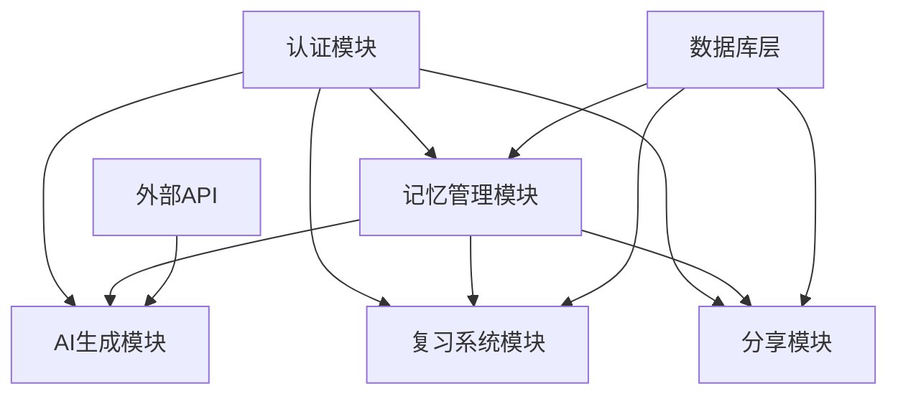

# MemBuddy 核心功能架构分析与重构计划

## 1. 项目概述

MemBuddy 是一个智能记忆辅助应用，通过AI技术帮助用户创建、管理和复习记忆内容。项目采用前后端分离架构，支持Web端、微信小程序多平台访问。

## 2. 核心功能模块识别

### 2.1 认证系统 (Authentication)

**功能边界：**

* 用户注册、登录、密码重置

* 微信小程序登录集成

* JWT token 管理

* 用户会话管理

**依赖关系：**

* 依赖：Supabase Auth、JWT库、微信API

* 被依赖：所有需要用户身份验证的模块

**技术实现：**

* 后端：FastAPI + Supabase Auth + 微信小程序登录

* 前端：React + 自定义 authManager

* 小程序：微信登录 + 自定义认证流程

**代码文件：**

* `back/routers/auth.py` - 认证路由和业务逻辑

* `back/dependencies.py` - JWT验证和用户依赖注入

* `back/schemas.py` - 用户和认证相关数据模型

* `front/lib/auth.js` - 前端认证管理器

* `mina/utils/auth.js` - 小程序认证工具

### 2.2 记忆管理模块 (Memory Management)

**功能边界：**

* 记忆内容的CRUD操作

* 记忆分类和标签管理

* 记忆搜索和筛选

* 记忆统计和分析

* 记忆辅助工具关联

**依赖关系：**

* 依赖：认证系统、数据库、AI生成模块

* 被依赖：复习系统、分享模块

**技术实现：**

* 后端：FastAPI + Supabase PostgreSQL

* 前端：React + 自定义组件

* 小程序：原生小程序组件

**代码文件：**

* `back/routers/memory_items.py` - 记忆项CRUD API

* `back/schemas.py` - 记忆项数据模型定义

* `front/app/page.tsx` - 前端主页面和记忆项展示

* `front/components/memory-*` - 记忆相关组件

* `mina/pages/index/index.js` - 小程序主页

* `mina/pages/memory-library/` - 小程序记忆库页面

### 2.3 AI生成模块 (AI Generation)

**功能边界：**

* 思维导图自动生成

* 记忆口诀和助记词生成

* 感官联想内容生成

* 多AI提供商统一管理

* AI请求监控和重试机制

**依赖关系：**

* 依赖：外部AI服务（Gemini、OpenAI等）

* 被依赖：记忆管理模块

**技术实现：**

* 后端：统一AI管理器 + 多提供商适配

* 支持国内外AI服务商

* 请求重试和错误处理机制

**代码文件：**

* `back/ai_manager.py` - AI服务统一管理器

* `back/ai_providers_global.py` - 国际AI提供商

* `back/ai_providers_china.py` - 国内AI提供商

* `back/routers/ai_generation.py` - AI生成API路由

* `back/mock_ai_provider.py` - 开发环境Mock提供商

### 2.4 复习系统模块 (Review System)

**功能边界：**

* 艾宾浩斯遗忘曲线算法实现

* 复习计划自动生成和管理

* 复习效果统计和分析

* 智能复习提醒

* 复习完成度追踪

**依赖关系：**

* 依赖：记忆管理模块、认证系统

* 被依赖：无

**技术实现：**

* 后端：FastAPI + 算法实现

* 前端：React + 复习界面组件

* 小程序：原生复习页面

**代码文件：**

* `back/routers/reviews.py` - 复习API路由

* `back/ai_manager.py` - 复习计划生成算法

* `front/app/review/` - 前端复习页面

* `mina/pages/review/` - 小程序复习页面

### 2.5 分享模块 (Sharing)

**功能边界：**

* 记忆内容公开分享

* 分享链接生成和管理

* 分享权限控制

* 分享访问统计

**依赖关系：**

* 依赖：记忆管理模块、认证系统

* 被依赖：无

**技术实现：**

* 后端：FastAPI + URL生成

* 前端：React + 分享组件

**代码文件：**

* `back/routers/sharing.py` - 分享API路由

* `front/components/share-dialog.tsx` - 分享对话框组件

## 3. 模块依赖关系分析



**依赖关系说明**:

* 认证模块是基础模块，其他所有模块都依赖于它

* 记忆管理模块是核心数据模块，AI生成、复习系统、分享模块都依赖于它

* 数据库层为数据持久化提供支持

* 外部API为AI功能提供服务

## 4. 代码质量评估

### 4.1 优势

* **模块化设计**: 各功能模块职责清晰，路由分离良好

* **技术栈现代化**: FastAPI + React + 微信小程序的现代技术栈

* **数据库设计**: 使用Supabase提供统一的认证和数据服务

* **API设计**: RESTful API设计规范，使用Pydantic进行数据验证

* **AI架构**: 统一的AI管理器支持多提供商切换

* **认证系统**: 完整的JWT认证和微信登录集成

### 4.2 待改进点

#### 4.2.1 错误处理和日志

* **问题**: 错误处理不够统一，部分异常处理过于宽泛

* **影响**: 调试困难，用户体验不佳

* **位置**: `back/routers/*.py`, `front/app/page.tsx`

* **建议**: 实现统一的错误处理中间件和结构化日志

#### 4.2.2 代码重复

* **问题**: 前端和小程序存在大量重复的API调用逻辑

* **影响**: 维护成本高，容易出现不一致

* **位置**: `front/lib/api-config.ts`, `mina/utils/api.js`

* **建议**: 抽象共同的API客户端库

#### 4.2.3 性能问题

* **问题**: AI生成过程阻塞用户操作，数据库查询未优化

* **影响**: 用户体验差，响应时间长

* **位置**: `back/routers/memory_items.py`, `back/ai_manager.py`

* **建议**: 实现异步处理和数据库查询优化

#### 4.2.4 测试覆盖

* **问题**: 缺乏完整的单元测试和集成测试

* **影响**: 代码质量无法保证，重构风险高

* **建议**: 建立完整的测试体系

### 4.3 技术债务

#### 4.3.1 高优先级

* **AI请求超时处理**: 当前重试机制不够完善

* **数据库连接池**: 缺乏连接池管理

* **前端状态管理**: 状态管理过于分散

#### 4.3.2 中优先级

* **缓存策略**: 缺乏Redis等缓存机制

* **数据迁移**: 缺乏数据库版本控制

* **监控告警**: 缺乏应用性能监控

#### 4.3.3 低优先级

* **代码分割**: 前端代码包过大

* **国际化**: 多语言支持不完整

* **SEO优化**: 前端SEO需要改进

## 5. 重构优先级

### 5.1 高优先级 (P0) - 核心稳定性

#### 5.1.1 统一错误处理机制

**目标**: 提升系统稳定性和调试效率
**涉及文件**:

* `back/main.py` - 全局异常处理中间件

* `back/routers/*.py` - 统一错误响应

* `front/lib/api-config.ts` - 前端错误处理
  **预估工期**: 3-5天

#### 5.1.2 AI服务稳定性优化

**目标**: 解决AI请求超时和失败问题
**涉及文件**:

* `back/ai_manager.py` - 重试机制优化

* `back/ai_providers_*.py` - 提供商容错
  **预估工期**: 5-7天

#### 5.1.3 数据库性能优化

**目标**: 提升查询性能，减少响应时间
**涉及文件**:

* `back/routers/memory_items.py` - 查询优化

* `back/database.py` - 连接池管理
  **预估工期**: 3-4天

### 5.2 中优先级 (P1) - 代码质量

#### 5.2.1 代码重复消除

**目标**: 减少维护成本，提高代码复用性
**涉及文件**:

* `front/lib/api-config.ts` 和 `mina/utils/api.js` - 统一API客户端

* 前端和小程序组件 - 抽象共同逻辑
  **预估工期**: 7-10天

#### 5.2.2 测试体系建设

**目标**: 建立完整的测试覆盖，保证重构安全
**新增文件**:

* `back/tests/` - 后端测试套件

* `front/__tests__/` - 前端测试套件
  **预估工期**: 10-14天

#### 5.2.3 异步处理优化

**目标**: 改善用户体验，避免阻塞操作
**涉及文件**:

* `back/routers/memory_items.py` - 异步AI生成

* `front/app/page.tsx` - 前端状态管理
  **预估工期**: 5-7天

### 5.3 低优先级 (P2) - 功能增强

#### 5.3.1 缓存机制实现

**目标**: 提升系统性能
**新增依赖**: Redis
**预估工期**: 5-7天

#### 5.3.2 监控和告警

**目标**: 提升运维能力
**新增工具**: APM监控
**预估工期**: 3-5天

#### 5.3.3 前端性能优化

**目标**: 提升加载速度和用户体验
**涉及**: 代码分割、懒加载
**预估工期**: 5-7天

## 6. 测试策略

### 6.1 单元测试

#### 6.1.1 后端测试

**框架**: pytest + pytest-asyncio
**覆盖范围**:

* API路由测试 (`back/routers/`)

* 业务逻辑测试 (`back/ai_manager.py`)

* 数据模型验证 (`back/schemas.py`)

* 认证和权限测试 (`back/dependencies.py`)

**测试文件结构**:

```
back/tests/
├── test_auth.py
├── test_memory_items.py
├── test_ai_manager.py
├── test_reviews.py
└── conftest.py
```

#### 6.1.2 前端测试

**框架**: Jest + React Testing Library
**覆盖范围**:

* 组件渲染测试

* 用户交互测试

* API调用测试

* 状态管理测试

**目标覆盖率**: 80%以上

### 6.2 集成测试

#### 6.2.1 API集成测试

* 完整的认证流程测试

* 记忆项CRUD操作测试

* AI生成流程测试

* 复习系统集成测试

#### 6.2.2 数据库集成测试

* Supabase连接测试

* 数据一致性验证

* 事务处理测试

#### 6.2.3 外部服务集成测试

* AI提供商API测试

* 微信登录集成测试

* 文件存储服务测试

### 6.3 端到端测试

#### 6.3.1 用户流程测试

**关键流程**:

1. 用户注册/登录流程
2. 创建记忆项 → AI生成 → 查看结果
3. 复习流程完整测试
4. 分享功能测试

#### 6.3.2 跨平台一致性测试

* 前端Web应用测试

* 微信小程序测试

* API响应一致性验证

#### 6.3.3 性能测试

* 并发用户测试

* AI生成响应时间测试

* 数据库查询性能测试

### 6.4 验证方案

#### 6.4.1 功能验证清单

* [ ] 用户认证功能完整性

* [ ] 记忆项管理功能

* [ ] AI生成功能稳定性

* [ ] 复习系统准确性

* [ ] 分享功能可用性

#### 6.4.2 性能验证指标

* API响应时间 < 2秒

* AI生成时间 < 30秒

* 页面加载时间 < 3秒

* 并发用户支持 > 100

#### 6.4.3 安全验证

* JWT token安全性

* API权限控制

* 数据访问隔离

* 敏感信息保护

## 7. 实施计划和里程碑

### 7.1 第一阶段：核心稳定性 (Week 1-3)

#### 里程碑 1.1：统一错误处理 (Week 1)

**目标**: 建立统一的错误处理和日志系统
**交付物**:

* 全局异常处理中间件

* 标准化错误响应格式

* 结构化日志配置

**验收标准**:

* [ ] 所有API错误都有统一格式

* [ ] 错误日志包含完整上下文信息

* [ ] 前端能正确处理和显示错误信息

#### 里程碑 1.2：AI服务优化 (Week 2)

**目标**: 提升AI服务的稳定性和可靠性
**交付物**:

* 改进的重试机制

* 超时处理优化

* 提供商容错机制

**验收标准**:

* [ ] AI请求成功率 > 95%

* [ ] 平均响应时间 < 25秒

* [ ] 超时和重试机制正常工作

#### 里程碑 1.3：数据库优化 (Week 3)

**目标**: 优化数据库查询性能
**交付物**:

* 查询优化

* 连接池配置

* 索引优化

**验收标准**:

* [ ] 记忆项列表查询 < 1秒

* [ ] 复杂查询响应时间 < 2秒

* [ ] 数据库连接稳定

### 7.2 第二阶段：代码质量 (Week 4-7)

#### 里程碑 2.1：代码重复消除 (Week 4-5)

**目标**: 减少前端和小程序的代码重复
**交付物**:

* 统一的API客户端库

* 共享组件抽象

* 通用工具函数

**验收标准**:

* [ ] API调用逻辑统一

* [ ] 代码重复率 < 10%

* [ ] 维护成本显著降低

#### 里程碑 2.2：测试体系建设 (Week 6-7)

**目标**: 建立完整的测试覆盖
**交付物**:

* 后端单元测试套件

* 前端组件测试

* 集成测试框架

**验收标准**:

* [ ] 后端测试覆盖率 > 80%

* [ ] 前端测试覆盖率 > 75%

* [ ] CI/CD集成测试通过

### 7.3 第三阶段：性能优化 (Week 8-10)

#### 里程碑 3.1：异步处理 (Week 8)

**目标**: 改善用户体验，避免阻塞操作
**交付物**:

* 异步AI生成流程

* 前端状态管理优化

* 后台任务队列

**验收标准**:

* [ ] 用户操作不被AI生成阻塞

* [ ] 前端响应更加流畅

* [ ] 后台任务正常执行

#### 里程碑 3.2：缓存和监控 (Week 9-10)

**目标**: 提升系统性能和运维能力
**交付物**:

* Redis缓存实现

* APM监控集成

* 性能指标仪表板

**验收标准**:

* [ ] 缓存命中率 > 70%

* [ ] 系统监控正常运行

* [ ] 性能指标可视化

### 7.4 第四阶段：验证和部署 (Week 11-12)

#### 里程碑 4.1：全面测试 (Week 11)

**目标**: 确保重构后系统稳定性
**交付物**:

* 端到端测试报告

* 性能基准测试

* 安全验证报告

**验收标准**:

* [ ] 所有核心功能正常

* [ ] 性能指标达标

* [ ] 安全验证通过

#### 里程碑 4.2：生产部署 (Week 12)

**目标**: 安全部署到生产环境
**交付物**:

* 部署脚本更新

* 回滚方案

* 监控告警配置

**验收标准**:

* [ ] 生产环境稳定运行

* [ ] 监控告警正常

* [ ] 用户反馈良好

## 8. 成功指标

### 8.1 技术指标

* **系统稳定性**: 99.5%+ 可用性

* **响应性能**: API响应时间 < 2秒

* **AI生成**: 成功率 > 95%，平均时间 < 25秒

* **代码质量**: 测试覆盖率 > 80%

### 8.2 业务指标

* **用户体验**: 错误率 < 1%

* **功能完整性**: 所有核心功能正常

* **维护效率**: 代码重复率 < 10%

* **部署效率**: 部署时间 < 10分钟

### 8.3 风险评估与缓解

#### 高风险

* **AI服务依赖**: 缓解措施 - 多提供商备份

* **数据迁移**: 缓解措施 - 分步迁移，完整备份

#### 中风险

* **性能回归**: 缓解措施 - 性能基准测试

* **功能缺失**: 缓解措施 - 完整的回归测试

#### 低风险

* **用户界面变化**: 缓解措施 - 渐进式更新

* **部署复杂性**: 缓解措施 - 自动化部署脚本

## 9. 成功指标

### 9.1 技术指标

* 代码覆盖率 > 80%

* API响应时间 < 500ms

* 前端首屏加载 < 3s

* 构建时间 < 5min

### 9.2 质量指标

* 代码重复率 < 5%

* 技术债务减少 50%

* Bug修复时间 < 24h

* 新功能开发效率提升 30%

### 9.3 用户体验指标

* 用户操作成功率 > 95%

* 错误恢复时间 < 10s

* 用户满意度 > 4.5/5

## 10. 风险评估与缓解

### 10.1 技术风险

* **风险**: 重构过程中引入新Bug

* **缓解**: 完善测试覆盖，分阶段发布

### 10.2 业务风险

* **风险**: 重构影响现有功能

* **缓解**: 向后兼容，灰度发布

### 10.3 时间风险

* **风险**: 重构时间超出预期

* **缓解**: 优先级管理，MVP原则

## 11. 下一步行动

1. **立即执行**: 建立测试框架和代码质量检查
2. **本周内**: 开始配置管理统一工作
3. **两周内**: 完成API客户端抽象设计
4. **一个月内**: 完成第一阶段重构目标

***

*本文档将根据重构进展定期更新，确保计划与实际执行保持同步。*
