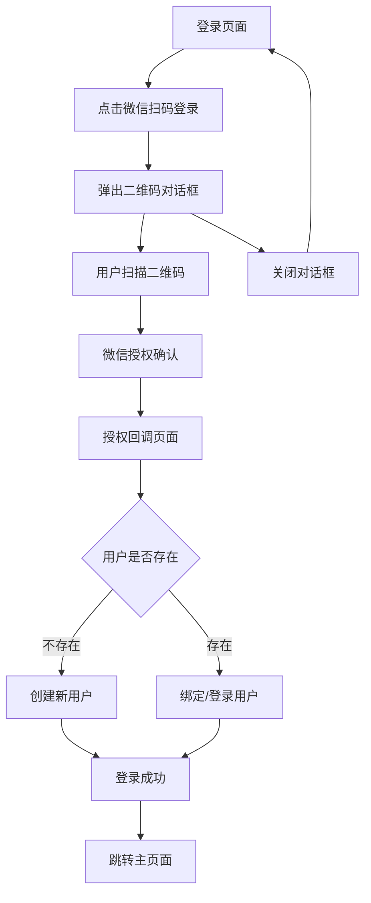

# 微信扫码登录功能需求文档

## 1. 产品概述

为MemBuddy记忆助手应用增加微信扫码登录功能，提供便捷的第三方登录方式。用户可通过微信扫描二维码快速登录，无需记忆账号密码，提升用户体验和登录转化率。

该功能基于微信开放平台网站应用授权，支持新用户自动注册和老用户账号绑定，为用户提供安全、便捷的登录体验。

## 2. 核心功能

### 2.1 用户角色

| 角色 | 注册方式 | 核心权限 |
|------|----------|----------|
| 新用户 | 微信扫码自动注册 | 可使用所有基础功能，自动创建账户 |
| 已注册用户 | 微信扫码绑定登录 | 可绑定微信账号，使用微信快速登录 |
| 微信绑定用户 | 微信扫码直接登录 | 已绑定微信的用户可直接扫码登录 |

### 2.2 功能模块

我们的微信扫码登录功能包含以下主要模块：

1. **登录页面**：微信扫码登录入口、二维码展示、登录状态轮询
2. **授权回调页面**：处理微信授权回调、用户信息获取、登录状态同步
3. **后端API接口**：微信授权验证、用户创建/绑定、JWT令牌生成

### 2.3 页面详情

| 页面名称 | 模块名称 | 功能描述 |
|----------|----------|----------|
| 登录页面 | 微信扫码入口 | 显示微信扫码登录按钮，点击后弹出二维码对话框 |
| 登录页面 | 二维码展示 | 生成并显示微信授权二维码，支持刷新和关闭操作 |
| 登录页面 | 登录状态轮询 | 定时检查登录状态，成功后自动跳转到主页面 |
| 授权回调页面 | 授权码处理 | 接收微信返回的授权码，调用后端API完成登录 |
| 授权回调页面 | 登录状态同步 | 将登录成功状态同步到父页面，关闭授权窗口 |
| 后端API | 微信授权验证 | 使用授权码获取用户access_token和用户信息 |
| 后端API | 用户创建/绑定 | 根据微信用户信息创建新用户或绑定现有用户 |
| 后端API | JWT令牌生成 | 生成应用内JWT令牌，用于后续API调用认证 |

## 3. 核心流程

### 3.1 用户操作流程

**新用户注册流程：**
1. 用户访问登录页面，点击"微信扫码登录"按钮
2. 系统弹出二维码对话框，显示微信授权二维码
3. 用户使用微信扫描二维码，在微信中确认授权
4. 系统自动创建新用户账户，绑定微信信息
5. 登录成功，跳转到应用主页面

**已注册用户绑定流程：**
1. 已注册用户点击"微信扫码登录"按钮
2. 扫描二维码完成微信授权
3. 系统检测到微信用户信息，绑定到现有账户
4. 登录成功，后续可直接使用微信扫码登录

**微信绑定用户登录流程：**
1. 已绑定微信的用户点击"微信扫码登录"按钮
2. 扫描二维码完成授权
3. 系统识别已绑定用户，直接登录成功
4. 跳转到应用主页面

### 3.2 页面导航流程图

## 4. 用户界面设计

### 4.1 设计风格

- **主色调**：深蓝渐变背景 (#1e3a8a 到 #1e40af)，微信绿色按钮 (#07c160)
- **按钮样式**：圆角按钮，微信绿色背景，白色图标和文字
- **字体**：系统默认字体，按钮文字14px，提示文字12px
- **布局风格**：居中卡片布局，毛玻璃效果背景，响应式设计
- **图标样式**：使用Lucide图标库，微信图标和二维码图标

### 4.2 页面设计概览

| 页面名称 | 模块名称 | UI元素 |
|----------|----------|--------|
| 登录页面 | 微信扫码按钮 | 绿色渐变按钮，微信图标，"微信扫码登录"文字，hover效果 |
| 登录页面 | 二维码对话框 | 白色背景，居中布局，二维码画布200x200px，关闭按钮 |
| 登录页面 | 扫码提示 | 白色半透明文字，"请使用微信扫描上方二维码"，居中显示 |
| 授权回调页面 | 加载状态 | 加载动画，"正在处理微信授权..."提示文字 |
| 授权回调页面 | 错误提示 | 红色错误文字，"授权失败，请重试"，返回按钮 |

### 4.3 响应式设计

该功能采用移动端优先的响应式设计，支持桌面端和移动端访问。二维码对话框在移动端会适配屏幕尺寸，确保二维码清晰可见。支持触摸交互优化，提供良好的移动端扫码体验。