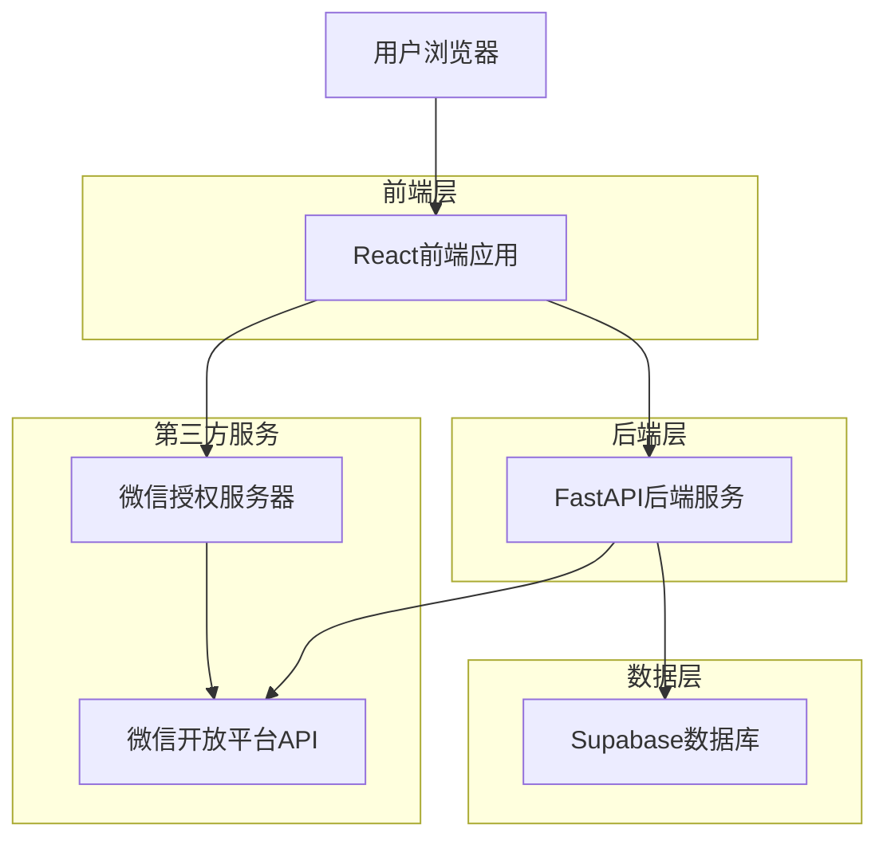
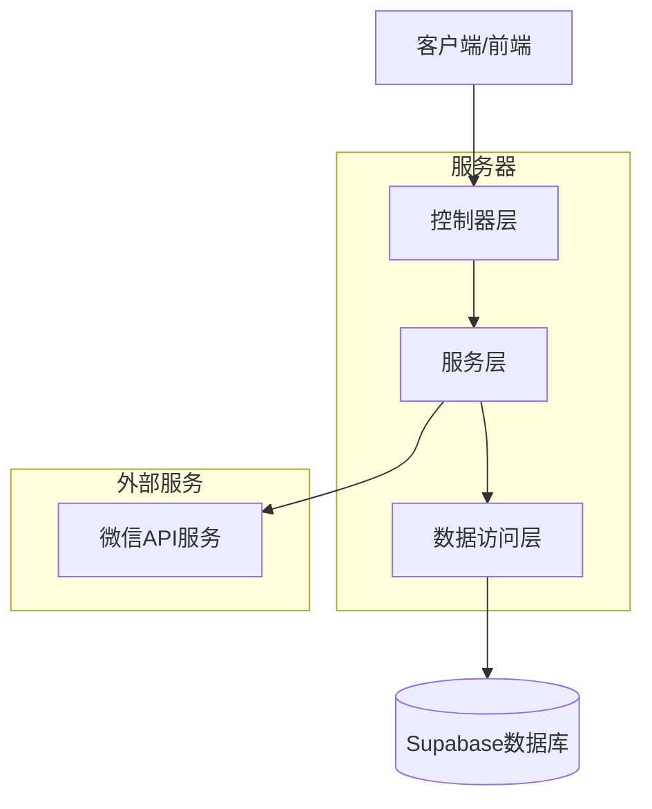
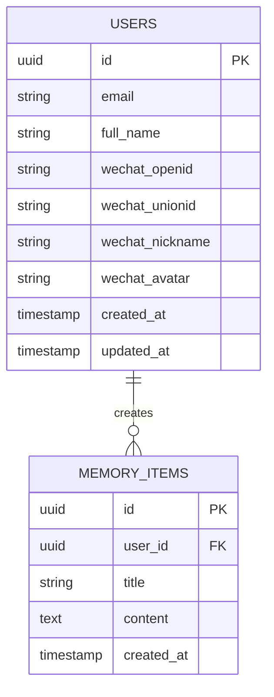

# 微信扫码登录技术架构文档

## 1. 架构设计



## 2. 技术描述

* **前端**: React\@18 + TypeScript + Next.js\@14 + TailwindCSS + Lucide图标

* **后端**: FastAPI + Python3.9+ + Pydantic + JWT认证

* **数据库**: Supabase (PostgreSQL)

* **第三方服务**: 微信开放平台网站应用API

* **工具库**: qrcode (二维码生成)、requests (HTTP请求)

## 3. 路由定义

| 路由                      | 用途              |
| ----------------------- | --------------- |
| /auth/login             | 登录页面，包含微信扫码登录入口 |
| /auth/wechat/callback   | 微信授权回调处理页面      |
| /api/auth/wechat/web    | 后端微信网站应用登录API接口 |
| /api/auth/wechat/qrcode | 生成微信授权二维码API接口  |

## 4. API定义

### 4.1 核心API

**微信扫码登录接口**

```
POST /api/auth/wechat/web
```

请求参数:

| 参数名称  | 参数类型   | 是否必需 | 描述            |
| ----- | ------ | ---- | ------------- |
| code  | string | true | 微信授权回调返回的授权码  |
| state | string | true | 防CSRF攻击的随机字符串 |

响应参数:

| 参数名称          | 参数类型   | 描述               |
| ------------- | ------ | ---------------- |
| access\_token | string | JWT访问令牌          |
| token\_type   | string | 令牌类型，固定为"bearer" |
| user          | object | 用户信息对象           |

请求示例:

```json
{
  "code": "021234567890abcdef",
  "state": "random_state_string"
}
```

响应示例:

```json
{
  "access_token": "eyJhbGciOiJIUzI1NiIsInR5cCI6IkpXVCJ9...",
  "token_type": "bearer",
  "user": {
    "id": "550e8400-e29b-41d4-a716-446655440000",
    "email": "wechat_openid123@membuddy.local",
    "full_name": "微信用户",
    "wechat_openid": "openid123",
    "wechat_unionid": "unionid456"
  }
}
```

**生成微信授权URL接口**

```
GET /api/auth/wechat/qrcode
```

请求参数:

| 参数名称          | 参数类型   | 是否必需  | 描述      |
| ------------- | ------ | ----- | ------- |
| redirect\_uri | string | false | 自定义回调地址 |

响应参数:

| 参数名称      | 参数类型   | 描述        |
| --------- | ------ | --------- |
| auth\_url | string | 微信授权URL   |
| state     | string | 状态参数，用于验证 |

## 5. 服务器架构图



## 6. 数据模型

### 6.1 数据模型定义



### 6.2 数据定义语言

**用户表扩展 (users)**

```sql
-- 为现有用户表添加微信相关字段（如果不存在）
ALTER TABLE users ADD COLUMN IF NOT EXISTS wechat_openid VARCHAR(255) UNIQUE;
ALTER TABLE users ADD COLUMN IF NOT EXISTS wechat_unionid VARCHAR(255);
ALTER TABLE users ADD COLUMN IF NOT EXISTS wechat_nickname VARCHAR(255);
ALTER TABLE users ADD COLUMN IF NOT EXISTS wechat_avatar TEXT;

-- 创建索引以提高查询性能
CREATE INDEX IF NOT EXISTS idx_users_wechat_openid ON users(wechat_openid);
CREATE INDEX IF NOT EXISTS idx_users_wechat_unionid ON users(wechat_unionid);

-- 设置行级安全策略
GRANT SELECT, INSERT, UPDATE ON users TO anon;
GRANT ALL PRIVILEGES ON users TO authenticated;
```

**微信授权状态表 (wechat\_auth\_states)**

```sql
-- 创建微信授权状态表，用于防止CSRF攻击
CREATE TABLE IF NOT EXISTS wechat_auth_states (
    id UUID PRIMARY KEY DEFAULT gen_random_uuid(),
    state VARCHAR(255) UNIQUE NOT NULL,
    created_at TIMESTAMP WITH TIME ZONE DEFAULT NOW(),
    expires_at TIMESTAMP WITH TIME ZONE DEFAULT (NOW() + INTERVAL '10 minutes'),
    used BOOLEAN DEFAULT FALSE
);

-- 创建索引
CREATE INDEX idx_wechat_auth_states_state ON wechat_auth_states(state);
CREATE INDEX idx_wechat_auth_states_expires_at ON wechat_auth_states(expires_at);

-- 设置权限
GRANT SELECT, INSERT, UPDATE ON wechat_auth_states TO anon;
GRANT ALL PRIVILEGES ON wechat_auth_states TO authenticated;

-- 自动清理过期记录的函数
CREATE OR REPLACE FUNCTION cleanup_expired_auth_states()
RETURNS void AS $$
BEGIN
    DELETE FROM wechat_auth_states WHERE expires_at < NOW();
END;
$$ LANGUAGE plpgsql;
```

## 7. 安全考虑

### 7.1 CSRF防护

* 使用随机生成的state参数防止CSRF攻击

* state参数存储在数据库中，设置10分钟过期时间

* 授权回调时验证state参数的有效性

### 7.2 数据安全

* 微信access\_token仅用于获取用户信息，不存储

* 用户敏感信息加密存储

* JWT令牌设置合理的过期时间

### 7.3 API安全

* 所有API接口都有适当的错误处理

* 限制授权回调的来源域名

* 记录关键操作日志用于审计

